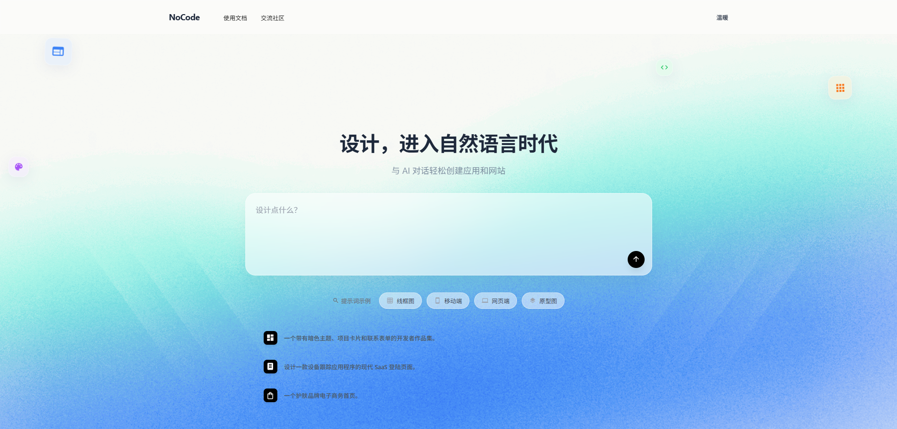
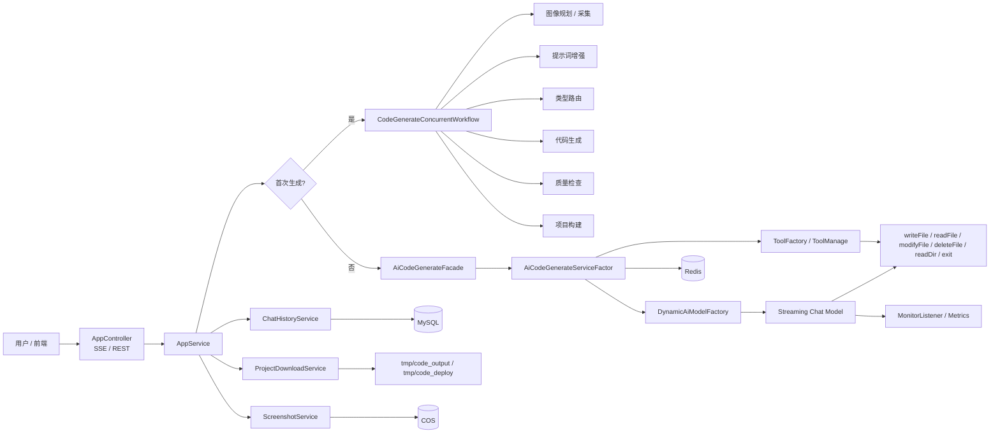
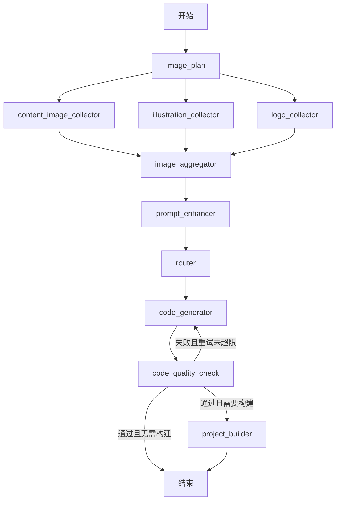
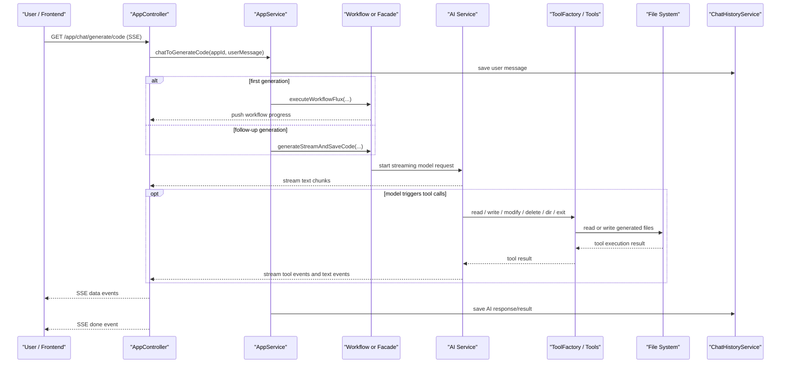

# AI 代码生成平台


[](https://opensource.org/licenses/MIT)

基于 Spring Boot、LangChain4j 和 LangGraph4j 的 AI 代码生成平台，面向“自然语言描述 -> 代码生成 -> 文件落盘 -> 项目部署/下载”的完整链路。

它不是一个只返回文本的聊天应用，而是一个带有工作流编排、工具调用、会话记忆、流式输出和项目构建能力的代码生成系统。



## 项目定位

这个项目主要解决以下场景：

- 用户通过自然语言描述需求，生成 HTML、原生多文件项目或 Vue 工程
- 生成过程通过 SSE 实时返回，前端可以边看边渲染
- 模型可以调用工具完成文件读写、目录查看、文件修改等操作
- 首次生成走完整工作流，后续对话走增量续写
- 生成完成后可以下载代码，也可以部署为可访问的应用

## 核心特性

- 多种生成模式：`html`、`multi_file`、`vue_project`
- 工作流驱动的首次生成流程
- 基于工具调用的代码落盘能力
- 基于 Redis 的会话记忆与历史消息加载
- 基于 SSE 的实时流式输出
- 支持代码下载、部署、下线
- 支持模型调用监控、日志记录和 Prometheus 指标暴露

## 技术栈

### 后端

- Spring Boot 3.5.6
- LangChain4j 1.2.0
- LangGraph4j 1.6.0-rc2
- MyBatis-Flex 1.11.0
- Redisson
- Caffeine
- Micrometer + Prometheus

### 前端

- Vue 3
- Vite

### 基础设施

- MySQL 8
- Redis 6+
- 腾讯云 COS

## 项目结构

```text
.
|-- src
|   |-- main
|   |   |-- java/com/xuenai/aicodegenerate
|   |   |   |-- ai                # 模型接入、工具系统、解析与保存
|   |   |   |-- controller        # REST / SSE 接口
|   |   |   |-- langgraph         # 工作流、节点、状态与工具
|   |   |   |-- monitor           # 监控、日志监听、指标采集
|   |   |   |-- service           # 业务服务层
|   |   |   `-- exception         # 全局异常处理
|   |   `-- resources
|   |       |-- application.yml
|   |       |-- application-local.yml
|   |       `-- mapper
|-- ai-code-generate-vue          # 前端项目
|-- ai-code-generate-admin        # 管理端项目
|-- sql/create_table.sql          # 建表脚本
`-- tmp
    |-- code_output               # 生成代码输出目录
    `-- code_deploy               # 部署产物目录
```

## 系统架构

### 总体架构



### 首次生成工作流

首次生成并不是直接调用模型，而是先走工作流，补齐图像资源、增强提示词、确定生成类型，再执行代码生成和质量检查。



### SSE 与工具调用时序

下面这张图更适合帮助前端、后端和排障同学理解一次完整的流式代码生成请求是怎么跑起来的。



## 关键模块说明

### 1\. 接口层

核心入口在 [AppController.java](https://www.google.com/search?q=src/main/java/com/xuenai/aicodegenerate/controller/AppController.java)。

其中最重要的接口是：

- `GET /app/chat/generate/code`：SSE 流式生成代码
- `POST /app/add`：创建应用
- `POST /app/deploy`：部署应用
- `POST /app/offline`：应用下线
- `GET /app/download/{appId}`：下载生成代码

### 2\. 应用服务层

[AppServiceImpl.java](https://www.google.com/search?q=src/main/java/com/xuenai/aicodegenerate/service/impl/AppServiceImpl.java) 负责串联“应用、对话、生成、部署”主流程：

- 首次生成：走 `CodeGenerateConcurrentWorkflow`
- 非首次生成：走 `AiCodeGenerateFacade.generateStreamAndSaveCode`
- 部署 Vue 项目时会先构建 `dist`
- 下载时从 `tmp/code_output/<type>_<appId>` 打包

### 3\. AI 服务层

[AiCodeGenerateServiceFactor.java](https://www.google.com/search?q=src/main/java/com/xuenai/aicodegenerate/ai/AiCodeGenerateServiceFactor.java) 负责：

- 按 `appId + generateType` 缓存 AI Service
- 绑定 Redis ChatMemory
- 加载历史消息到上下文
- 注入工具集合
- 配置输入护栏和工具调用策略

### 4\. 工具系统

当前注册的核心工具位于 `src/main/java/com/xuenai/aicodegenerate/ai/tools`：

这些工具会通过 [ToolFactory.java](https://www.google.com/search?q=src/main/java/com/xuenai/aicodegenerate/ai/tools/ToolFactory.java) 注入上下文，使同一个应用下的工具操作具备目录和生成类型感知能力。

### 5\. 本地 LangChain4j 覆写

项目在 `src/main/java/dev/langchain4j` 下对部分 LangChain4j 类做了本地覆写，用于处理流式工具调用、SSE 场景和工具执行兼容性问题。

这意味着：

- 这个目录不是普通业务代码，而是框架行为定制层
- 后续升级 LangChain4j 时，需要重点核对这一层的兼容性

## 代码生成模式

[CodeGenerateTypeEnum.java](https://www.google.com/search?q=src/main/java/com/xuenai/aicodegenerate/model/enums/CodeGenerateTypeEnum.java) 当前定义了三种模式：

| 模式 | 值 | 说明 |
|---|---|---|
| 原生 HTML 模式 | `html` | 输出单页或简单静态内容 |
| 原生多文件模式 | `multi_file` | 输出多文件结构，不额外构建 |
| Vue 工程模式 | `vue_project` | 输出 Vue 项目，部署前需要构建 |

## 快速开始

### 环境要求

- JDK 21+
- Maven 3.8+
- MySQL 8.0+
- Redis 6.0+
- Node.js 16+

### 1\. 克隆项目

```bash
git clone <your-repo-url>
cd ai-code-generate
```

### 2\. 初始化数据库

```sql
CREATE DATABASE ai_auto_generate CHARACTER SET utf8mb4 COLLATE utf8mb4_unicode_ci;
```

```bash
mysql -u root -p ai_auto_generate < sql/create_table.sql
```

### 3\. 配置本地环境与大模型密钥

编辑 `src/main/resources/application-local.yml`，完成以下配置：

- **数据库与缓存**：配置你的 `spring.datasource` 和 `spring.data.redis` 账号密码。
- **大模型 API Key（必填）**：在 `langchain4j` 相关配置中填入你使用的模型 API Key 和 Base URL。
- **对象存储**：配置 `cos.client` 等第三方服务（可选）。

> **注意**：请勿将包含真实密钥的配置文件直接 Commit 提交到远程仓库。

### 4\. 启动后端

Linux / macOS:

```bash
./mvnw clean package -DskipTests
java -jar target/ai-code-generate-0.0.1-SNAPSHOT.jar --spring.profiles.active=local
```

Windows:

```bash
mvnw.cmd clean package -DskipTests
java -jar target/ai-code-generate-0.0.1-SNAPSHOT.jar --spring.profiles.active=local
```

### 5\. 启动前端

```bash
cd ai-code-generate-vue
npm install
npm run dev
```

## 生成产物与部署目录

[AppConstant.java](https://www.google.com/search?q=src/main/java/com/xuenai/aicodegenerate/constant/AppConstant.java) 中定义了关键目录：

- 代码输出目录：`tmp/code_output`
- 部署输出目录：`tmp/code_deploy`

## 开发注意事项

### 1\. `langchain4j` 覆写层不是普通业务代码

`src/main/java/dev/langchain4j` 中的类会直接影响流式输出、工具聚合和工具执行行为。如果修改这里的代码，请把它当作“框架兼容层”看待。

### 2\. 流式工具调用必须按同一个 index 聚合

模型流式返回的 `tool_calls` 可能分多段返回。如果这里没有按稳定的 `tool call index` 聚合，就会出现有参数无工具名等导致 `toolExecutor is null` 的异常。

### 3\. 工具执行失败应优先降级

当模型返回异常 tool call 时，更合理的行为是返回“没有该工具”或“工具名缺失”的结果给模型，让模型继续收敛，而不是直接抛错打崩整条链路。

### 4\. 工具调用的路径安全防御 (重要)

请在后续开发中确保所有文件操作（如 `FileWriteTool`, `FileDeleteTool` 等）具备严格的**路径沙箱校验**，防止大模型幻觉生成包含 `../` 的路径导致跨目录越权操作。

### 5\. SSE 异常返回必须保持事件流语义

SSE 接口报错时，不要再混用普通 JSON 异常响应，否则极易出现 `getOutputStream() has already been called` 冲突。

## 常用地址

- 接口文档：`http://localhost:8080/api/doc.html`
- 健康检查：`http://localhost:8080/api/actuator/health`
- Prometheus 指标：`http://localhost:8080/api/actuator/prometheus`

